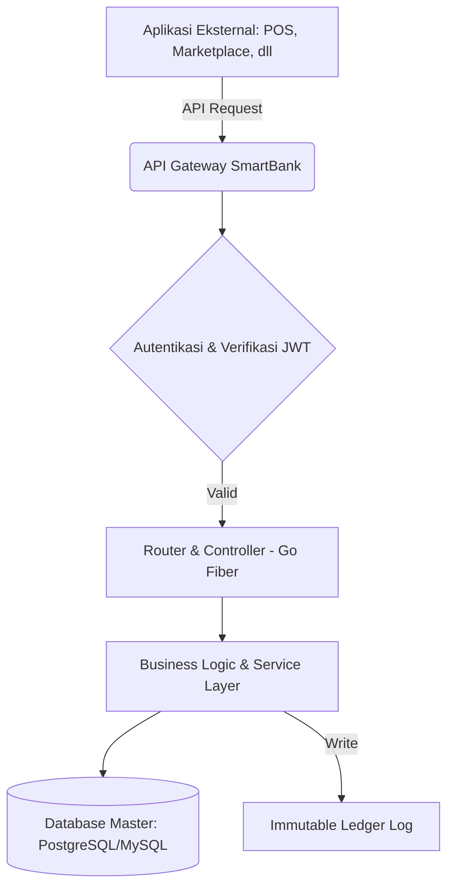

# Laporan Tugas Besar: SmartBank (Core)
**Mata Kuliah:** Rekayasa Perangkat Lunak 2 (RPL 2)  
**Dosen Pengampu:** M. Yusril Helmi Setyawan, S.Kom., M.Kom.

---

## 1. Deskripsi Aplikasi
**SmartBank** adalah aplikasi *core banking* yang berfungsi sebagai regulator sentral, prosesor pembayaran (*payment processor*), serta sistem pendataan utama (*single source of truth*) dalam sebuah ekosistem aplikasi terintegrasi. Semua transaksi keuangan dari platform eksternal (Marketplace, Point of Sale, Hub Logistik) wajib melalui protokol API Gateway SmartBank. SmartBank bertanggung jawab mengatur peredaran pasokan uang (*money supply*), cadangan bank (*bank reserve*), potongan pajak ekosistem, hingga suku bunga pinjaman untuk menjaga stabilitas sirkulasi keuangan ekonomi digital.

---

## 2. Use Case / Fitur Utama
1. **Registrasi & Autentikasi User (JWT):** Registrasi akun baru nasabah serta proses autentikasi (Login) dengan sistem *Role-Based Access Control* (RBAC) bagi nasabah, Admin, Manajer, dan Teller.
2. **Manajemen Saldo & Riwayat:** Melihat mutasi rekening, saldo akhir, serta analitik keluar-masuknya dana dari tiap nasabah.
3. **Transfer Ekosistem:** Layanan pemindahan dana antar nasabah secara internal maupun eksternal antar platform.
4. **Payment Gateway (Pembayaran Transaksi):** Pintu pembayaran dari seluruh aplikasi pihak ketiga dengan proteksi *cooldown* transaksi.
5. **Kredit & Pinjaman (Loan Disbursement):** Pengajuan dan penyaluran kredit konsumtif dengan bunga terukur dari *bank reserve*.
6. **Pemotongan Pajak & Biaya Otomatis (Tax & Fee):** Mekanisme *money sink* melalui potongan layanan bank dan pajak ekosistem di setiap arus transaksi.
7. **Pencatatan Ledger Transaksi:** Sistem akuntansi permanen yang mencatat rekam jejak setiap pergerakan debit dan kredit (*immutable log*).
8. **Dasbor Administratif & Kebijakan Moneter:** Antarmuka khusus untuk mengatur kebijakan moneter (suku bunga, batasan limit, pajak) dan memvalidasi *KYC*.

---

## 3. Diagram Arsitektur (Konsep)

---

## 4. Flow Proses (IPO - Input, Process, Output)
*Contoh pada Endpoint Pembayaran Transaksi:*
- **Input:** Request berisikan `user_id` pembayar, `target_id` (jika ada), jumlah uang (`amount`), jenis transaksi, dan meta-data pendukung. Serta header Authorization JWT.
- **Process:** 
  1. Validasi token dan kepemilikan saldo (Saldo ≥ *amount* + *fees*).
  2. Pemotongan saldo nasabah pembayar (Debit).
  3. Pemotongan biaya operasional (*Bank Fee*) sebesar sekian persen masuk ke *Reserve*.
  4. Pemotongan pajak (*Tax*) sebagai penyeimbang ekonomi.
  5. Penambahan saldo kepada penerima (Kredit).
  6. Penyimpanan rincian transaksi ke Ledger Utama.
- **Output:** Respons format JSON yang menyatakan status transaksi `SUCCESS`, beserta *Transaction ID*, sisa saldo, dan rincian pemotongan dana.

---

## 5. API Endpoint (Ringkasan)
Aplikasi didukung dengan spesifikasi interaktif **Swagger API** (dapat diakses pada rute `/swagger/index.html`). Beberapa endpoint utamanya antara lain:
- `POST /api/auth/login` - Menghasilkan token JWT autentikasi.
- `GET /api/user/balance` - Mendapatkan info saldo & riwayat (Memerlukan Token).
- `POST /api/transactions/transfer` - Memproses perpindahan uang.
- `POST /api/transactions/payment` - Memproses permintaan pembayaran eksternal.
- `GET /api/admin/ledgers` - [ADMIN] Mengambil seluruh log ledger historis sistem.

---

## 6. Integrasi SmartBank (Ecosystem Connectivity)
SmartBank tidak beroperasi secara terisolasi. Aplikasi lain berinteraksi dengan cara:
- **Write Operations:** Menghubungi endpoint seperti `/payment` dan mengirim otorisasi (token JWT pengguna terkait) agar saldo dikurangi atau ditambahkan pada pihak pedagang.
- **Read Operations:** Melalui hak akses API khusus (seperti UMKM Insight), aplikasi luar dapat mem-parsing data peredaran uang dengan status *Read-Only* secara teragregasi.

---

## 7. Desain Database (Struktur Dasar)
- **Tabel `users`:** Menyimpan informasi primer nasabah & staf (ID, Nama, Email, Hash Password, Role, Status KYC, dan Saldo).
- **Tabel `ledgers`:** Memuat histori pembukuan (`transaction_id`, `from_user`, `to_user`, `amount`, `tax_fee`, `timestamp`, `description`).
- **Tabel `loans`:** Mencatat utang berjalan pengguna, bunga, tanggal jatuh tempo, dan riwayat pembayaran cicilan.

---

## 8. Mekanisme Transaksi & Kebijakan
Untuk menjaga ekonomi digital tidak mengalami hiperinflasi atau stagnasi deflasi:
- Total uang (*Money Supply*) yang bersirkulasi dibatasi **maksimal Rp 1 Miliar**.
- Dana yang belum beredar disimpan dalam *Bank Reserve* (target proporsi ±98% di awal).
- Terdapat **Pajak Sistem (2%)** per transaksi untuk menghapus uang perlahan dari peredaran, serta **Biaya Bank (1%)** yang kembali ke kas *Reserve*.

---

## 9. Antarmuka (UI/UX)
Pengembangan difokuskan untuk menampilkan tata letak dinamis dan terstruktur:
- **Dasbor Admin:** Bergaya *cyber/high-tech* neon, menampilkan analitik komprehensif log *ledger*, manajemen *role* pengguna, serta *slider* interaktif pengatur parameter ekonomi global.
- Semua antarmuka di sisi *client* ditenagai oleh API *backend* sungguhan (*dummy data JSON* telah sepenuhnya dihapus).

---

## 10. Skenario Pengujian (Testing)
Pengujian sistem diotomatisasi secara masif menggunakan *Postman Collections*.
- Menguji status HTTP (200 OK, 401 Unauthorized, 403 Forbidden).
- Validasi logika negatif: Memastikan bahwa saldo tidak boleh di bawah nol ketika mencoba melakukan transfer (akan me-return *error*).
- Tes RBAC: Memastikan akun dengan *role* nasabah biasa ditolak aksesnya oleh sistem apabila mengakses *endpoint* manajemen *dashboard* Admin.

---

## 11. Kendala dan Solusi
*Rincian lengkap dari kendala serta penanganannya selama pengembangan proyek (seperti migrasi DB, perbaikan celah JWT, dll) terlampir dalam dokumen terpisah:*
👉 Silakan merujuk ke file: `LAPORAN_KENDALA.md`

---

## 12. Dokumentasi Tim
**(Bagian ini dapat Anda sesuaikan dengan nama-nama anggota kelompok yang sebenarnya bertugas)**

| No | Nama | Peran / Jobdesc |
|---|---|---|
| 1 | [Malik] | Backend & API Architecture (Go Fiber) |
| 2 | [Zahra] | UI/UX & Frontend Integration |
| 3 | [Rafli] | Database Design & Security (JWT RBAC) |
