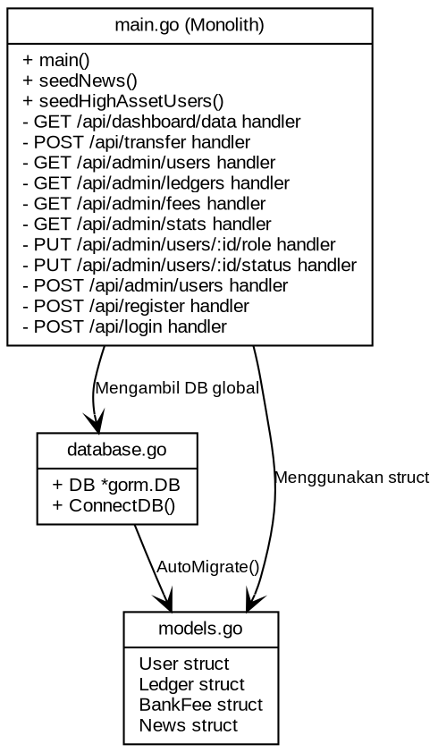
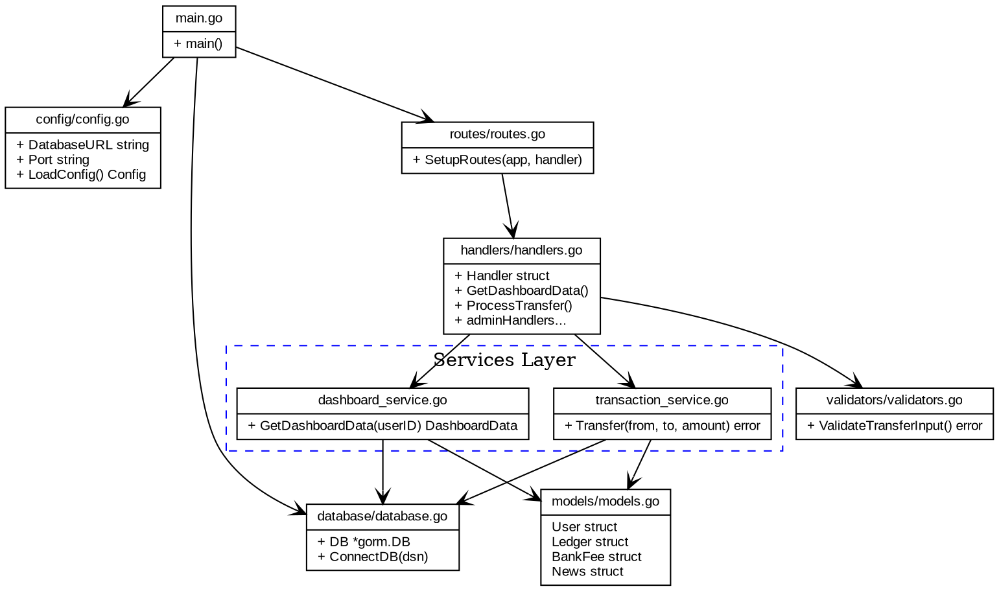

# Laporan Analisis dan Refactoring Kode: SmartBank (Core)
**Mata Kuliah:** Rekayasa Perangkat Lunak 2 (RPL 2)  
**Pertemuan:** P14  
**Topik:** MVC, SOLID, Clean Code, High Cohesion, Low Coupling, dan Refactoring  
**Kelompok:** Kelompok 3 (Malik, Zahra, Rafli)  
**Tanggal:** 22 Juni 2026  

---

## 1. Identitas Proyek
- **Nama Aplikasi:** SmartBank (Core Banking & Payment Gateway)
- **Jenis Aplikasi:** Web Service / RESTful API (Backend) & Single Page Application (Frontend Dashboard)
- **Topik Analisis:** Evaluasi Arsitektur MVC, SOLID Principles, Clean Code, Cohesion-Coupling, dan Refactoring Kode Monolitik
- **Anggota Kelompok:**
  1. **Malik** (Backend & API Architecture - Go Fiber)
  2. **Zahra** (UI/UX & Frontend Integration)
  3. **Rafli** (Database Design & Security - JWT RBAC)
- **Repository:** `https://github.com/MuhammadMallq/SmartBankTeam`
- **Tanggal Analisis:** 22 Juni 2026

---

## 2. Deskripsi Singkat Aplikasi
**SmartBank** adalah aplikasi *core banking* dan *payment processor* sentral dalam ekosistem digital terintegrasi. Aplikasi ini memegang peran krusial sebagai *single source of truth* untuk seluruh transaksi finansial yang terjadi di platform eksternal seperti Marketplace (PasarKita), Point of Sale (POS), dan Hub Logistik (LogistiKita). 

### Fitur Utama:
1. **Registrasi & Autentikasi User (JWT):** Registrasi akun nasabah baru dan login aman dengan pembagian peran (*Role-Based Access Control* - RBAC) untuk Nasabah, Admin, Manajer, Teller, dan Operator.
2. **Manajemen Saldo & Riwayat:** Dashboard untuk memantau saldo akhir, riwayat debit/kredit, serta log mutasi rekening.
3. **Transfer Dana Ekosistem:** Layanan transfer dana internal antar nasabah maupun transaksi pembayaran merchant pihak ketiga.
4. **Loan Disbursement (Kredit/Pinjaman):** Pengajuan dan penyaluran kredit konsumtif berbunga dari *bank reserve* dengan batasan limit tertentu.
5. **Pemotongan Pajak & Biaya Otomatis (Tax & Fee):** Mekanisme *money sink* otomatis yang mengenakan biaya transaksi dan pajak sistem secara berkala guna menyeimbangkan suplai uang beredar.
6. **Pencatatan Ledger Utama:** Pencatatan setiap transaksi keuangan ke dalam tabel ledger sebagai pembukuan ganda (*double-entry bookkeeping*) yang bersifat *immutable*.

### Batasan Analisis:
Analisis dan perencanaan refactoring ini dibatasi pada bagian **Backend Core** (`backend/main.go` dan `backend/database/database.go`) yang mengontrol routing API, interaksi database, aturan bisnis, dan integrasi data.

---

## 3. Tujuan Refactoring
Proses refactoring pada repositori SmartBank diarahkan untuk mencapai beberapa sasaran kualitas perangkat lunak:
1. **Meningkatkan Maintainability:** Mengurangi kepadatan dan kompleksitas pada file tunggal `main.go` dengan menerapkan arsitektur berlapis (modular MVC).
2. **Menjamin Data Integrity:** Menerapkan transaksi database atomik (*ACID*) pada transaksi finansial krusial seperti transfer dana untuk mencegah inkonsistensi saldo saat terjadi kegagalan sistem.
3. **Meningkatkan Keamanan (Security):** Memisahkan kredensial database dari kode sumber (*hardcoded*) ke konfigurasi berbasis Environment Variables serta meningkatkan validasi input API.
4. **Meningkatkan Performa & Skalabilitas:** Mengganti mekanisme pemrosesan data *in-memory* (looping data di Go) dengan query SQL terfilter langsung di tingkat database.
5. **Kepatuhan Aturan Bisnis (Business Rule Compliance):** Memastikan perhitungan biaya bank (1%) dan pajak sistem (2%) dihitung secara terpisah sesuai kontrak spesifikasi keuangan, bukan digabung secara kasar menjadi 3% fee bank tunggal.

---

## 4. Ruang Lingkup Analisis Kode
Analisis dilakukan terhadap 5 modul/file/method utama dalam direktori `backend/`:
1. **Fungsi Koneksi Database (`backend/database/database.go` -> `ConnectDB()`):** Pemeriksaan cara koneksi ke database MySQL serta inisialisasi awal.
2. **Endpoint Dashboard Data (`backend/main.go` -> `GET /api/dashboard/data`):** Pemeriksaan metode penarikan data summary saldo, mutasi ledger, berita, dan biaya.
3. **Endpoint Proses Transfer (`backend/main.go` -> `POST /api/transfer`):** Analisis alur pengurangan saldo pengirim, penambahan saldo penerima, kalkulasi biaya bank/pajak, serta penulisan tabel ledger dan bank fee.
4. **Endpoint Registrasi & Login (`backend/main.go` -> `POST /api/register` & `POST /api/login`):** Analisis cara validasi kredensial user, pemeriksaan keunikan email, dan pengecekan akun tersuspensi.
5. **Modul Administratif (`backend/main.go` -> `PUT /api/admin/users/:id/role` & `PUT /api/admin/users/:id/status`):** Analisis perubahan hak akses pengguna secara dinamis tanpa validasi otorisasi bertingkat di tingkat API handler.

---

## 5. Struktur Folder Aplikasi (Aktual)
Struktur direktori SmartBank sebelum dilakukan refactoring adalah sebagai berikut:
```
SmartBank/
├── backend/
│   ├── database/
│   │   └── database.go         # File koneksi dan migrasi GORM (MySQL)
│   ├── models/
│   │   └── models.go           # File definisi struct model data
│   ├── main.go                 # Monolith file (Routing, handler, seeding)
│   └── test_api.js             # Skrip uji fungsionalitas HTTP Client (Node.js)
├── frontend/
│   ├── public/                 # Aset publik statis
│   ├── src/                    # Berkas sumber javascript dan CSS
│   ├── index.html              # Landing page utama
│   ├── dashboard.html          # Panel nasabah
│   ├── admin-dashboard.html    # Panel administrasi
│   ├── cs-dashboard.html       # Panel customer service
│   ├── manager-dashboard.html  # Panel manager kebijakan moneter
│   ├── teller-dashboard.html   # Panel teller kas
│   ├── operator-dashboard.html # Panel operator KYC
│   ├── login.html              # Laman login nasabah
│   ├── register.html           # Laman registrasi nasabah
│   ├── package.json            # Manifest dependensi frontend
│   └── replace.cjs             # Script replacement otomatis dummy data
├── LAPORAN_KENDALA.md          # Log kendala teknis tim
├── LAPORAN_TUGAS_BESAR.md      # Laporan ringkasan sistem
└── SmartBank.md                # Spesifikasi dan aturan moneter ekosistem
```

---

## 6. Ringkasan Arsitektur MVC
Penerapan MVC (*Model-View-Controller*) pada kode awal SmartBank diidentifikasi sebagai berikut:
1. **Model:** Direpresentasikan oleh struct data GORM di file `backend/models/models.go` (mengatur model `User`, `Ledger`, `BankFee`, dan `News`).
2. **View:** Menggunakan web statis HTML dan JavaScript (AJAX Fetch API) di folder `frontend/` untuk merender data mentah dari backend menjadi visual antarmuka pengguna.
3. **Controller & Route (Tergabung):** Didefinisikan secara langsung (inline) di dalam `backend/main.go`. Semua routing mendaftarkan fungsi anonim (*anonymous closures*) sebagai pengendali request. Logika validasi data, kalkulasi moneter, penulisan DB, dan parsing payload dilakukan di tempat yang sama.
4. **Database:** Menggunakan database MySQL yang diakses melalui pustaka GORM ORM di file `backend/database/database.go`.

---

## 7. Daftar Temuan Masalah Kode
Berdasarkan tinjauan kode pada `backend/main.go` dan `backend/database/database.go`, diidentifikasi **6 temuan masalah kode** sebagai berikut:

| No | Temuan Masalah | Lokasi Kode | Pelanggaran Prinsip | Dampak Negatif | Rekomendasi Refactoring |
|---|---|---|---|---|---|
| 1 | **Monolithic main.go** (Seluruh konfigurasi routing, inisialisasi server, handler endpoint, dan seeding database diletakkan dalam satu file). | `backend/main.go` | Single Responsibility Principle (SRP), Separation of Concerns (SoC) | Keterbacaan buruk, kopling sangat ketat, sulit dikembangkan, dan mustahil dibuatkan unit testing secara terisolasi. | Memecah `main.go` menjadi beberapa sub-package terstruktur: `config`, `routes`, `handlers`, `services`, dan `validators`. |
| 2 | **Kredensial Database Hardcoded** (String koneksi DSN MySQL ditulis mentah di dalam kode). | `backend/database/database.go` L-14 | Twelve-Factor App (III. Config), Security | Keamanan buruk. Membocorkan username/password ke repositori Git. Sulit bermigrasi antar lingkungan (dev/staging/prod) tanpa compile ulang. | Membaca konfigurasi koneksi menggunakan environment variables (`os.Getenv`) dengan nilai *fallback* default aman. |
| 3 | **Proses Transfer Tidak Atomik** (Pengurangan saldo pengirim, penambahan penerima, penulisan ledger dilakukan satu per satu tanpa transaksi SQL). | `backend/main.go` L-150 s.d L-204 | ACID (Atomicity & Consistency) | Kerentanan *data corruption*. Jika server terhenti di tengah eksekusi, saldo pengirim berkurang tetapi saldo penerima tidak bertambah (dana hilang). | Menggunakan penanganan database transaksi (`db.Transaction`) dari GORM untuk memastikan semua perintah sukses atau dibatalkan sepenuhnya jika terjadi kesalahan. |
| 4 | **Penyaringan Data Secara In-Memory** (Endpoint `/api/dashboard/data` menarik seluruh user dan ledger ke memori server lalu menyaringnya dengan perulangan Go). | `backend/main.go` L-40, L-67, L-80 | Performance, Scalability | Kinerja server menurun drastis seiring bertambahnya record di tabel ledger. Memakan memori (RAM) sangat besar dan CPU overhead akibat pencarian linear $O(N)$ di memori server. | Mengoptimalkan query SQL dengan menambahkan filter `WHERE` menggunakan GORM (`db.Where`) agar database hanya mengembalikan data spesifik milik user tersebut. |
| 5 | **Pengabaian Aturan Pajak & Fee** (Biaya bank dan pajak sistem digabung secara kasar menjadi 3% fee bank tunggal, field pajak dibiarkan bernilai 0). | `backend/main.go` L-161 s.d L-180 | Business Rule Compliance, Clean Code | Laporan pajak dan pembukuan ledger tidak sesuai dengan spesifikasi di `SmartBank.md` (1% fee bank + 2% pajak sistem). Menghalangi audit keuangan ekosistem yang valid. | Memisahkan perhitungan 1% fee bank (ke reserve bank) dan 2% pajak sistem (ke kas pajak) secara eksplisit di database serta ledger log. |
| 6 | **Ketiadaan Validasi Batas Nominal & Saldo** (API transfer menerima nominal negatif dan tidak memeriksa kecukupan saldo sebelum melakukan debit). | `backend/main.go` L-150 s.d L-159 | Clean Code (Robustness), Defensively Programming | User dapat mentransfer nominal negatif (menghisap saldo akun lain) atau melakukan transfer melebihi saldonya sehingga saldo menjadi minus (overdraft ilegal). | Membuat modul validator yang memeriksa apakah nominal transfer $> 0$, pengirim tidak sama dengan penerima, dan saldo pengirim $\ge$ nominal + fee + pajak. |

---

## 8. Analisis Before-After Refactoring

### Temuan 1: Struktur main.go Monolitik vs Terpisah (Clean Architecture)
- **Sebelum Refactoring (Monolithic):**
```go
// main.go menyimpan ratusan baris handler routing secara langsung
func main() {
    database.ConnectDB()
    app := fiber.New()
    app.Use(cors.New())
    
    app.Get("/api/dashboard/data", func(c *fiber.Ctx) error {
        // Logika dashboard...
    })
    app.Post("/api/transfer", func(c *fiber.Ctx) error {
        // Logika transfer...
    })
    // ...puluhan endpoint lainnya ditulis inline
    log.Fatal(app.Listen(":3000"))
}
```

- **Sesudah Refactoring (Clean Architecture):**
```go
// backend/main.go dibuat bersih dan minimalis
package main

import (
	"log"
	"smartbank-backend/config"
	"smartbank-backend/database"
	"smartbank-backend/handlers"
	"smartbank-backend/routes"
	"github.com/gofiber/fiber/v2"
)

func main() {
	cfg := config.LoadConfig()
	database.ConnectDB(cfg.DatabaseURL)

	app := fiber.New()
	handler := handlers.NewHandler(database.DB)

	routes.SetupRoutes(app, handler)

	log.Fatal(app.Listen(":" + cfg.Port))
}
```

---

### Temuan 2: Kredensial Database Hardcoded vs Environment Variables
- **Sebelum Refactoring (Hardcoded DSN):**
```go
// backend/database/database.go
func ConnectDB() {
    dsn := "root:@tcp(127.0.0.1:3306)/smartbank1?charset=utf8mb4&parseTime=True&loc=Local"
    db, err := gorm.Open(mysql.Open(dsn), &gorm.Config{})
    // ...
}
```

- **Sesudah Refactoring (Config/Env Variables):**
```go
// backend/config/config.go
package config

import "os"

type Config struct {
	DatabaseURL string
	Port        string
}

func LoadConfig() Config {
	dbURL := os.Getenv("DATABASE_URL")
	if dbURL == "" {
		// Fallback default aman
		dbURL = "root:@tcp(127.0.0.1:3306)/smartbank1?charset=utf8mb4&parseTime=True&loc=Local"
	}
	port := os.Getenv("PORT")
	if port == "" {
		port = "3000"
	}
	return Config{DatabaseURL: dbURL, Port: port}
}
```

---

### Temuan 3: Transaksi Transfer Tidak Atomik vs Transaksi database (Atomic Transaction)
- **Sebelum Refactoring (Non-Atomic):**
```go
// backend/main.go
// Saldo berkurang dulu baru penerima ditambah secara terpisah (tanpa perlindungan roll back)
database.DB.Exec("UPDATE users SET balance = balance - ? WHERE id = ?", totalDeduction, fromUser)
// Jika koneksi putus di sini, uang hilang di jalan
database.DB.Exec("UPDATE users SET balance = balance + ? WHERE id = ?", req.Amount, req.ToUser)
```

- **Sesudah Refactoring (Atomic Transaction):**
```go
// backend/services/transaction_service.go
func (s *TransactionService) Transfer(fromID, toID string, amount float64) error {
	return s.db.Transaction(func(tx *gorm.DB) error {
		var sender, receiver models.User
		if err := tx.Set("gorm:query_option", "FOR UPDATE").First(&sender, "id = ?", fromID).Error; err != nil {
			return err
		}
		if err := tx.Set("gorm:query_option", "FOR UPDATE").First(&receiver, "id = ?", toID).Error; err != nil {
			return err
		}

		feeBank := amount * 0.01
		feePajak := amount * 0.02
		totalDeduction := amount + feeBank + feePajak

		if sender.Balance < totalDeduction {
			return errors.New("saldo tidak mencukupi")
		}

		// Potong saldo pengirim
		if err := tx.Model(&sender).Update("balance", sender.Balance - totalDeduction).Error; err != nil {
			return err
		}
		// Tambah saldo penerima
		if err := tx.Model(&receiver).Update("balance", receiver.Balance + amount).Error; err != nil {
			return err
		}
		
		// Buat ledger & log lainnya...
		return nil // Commit otomatis jika semua sukses
	})
}
```

---

### Temuan 4: Filter Data Dashboard Secara In-Memory vs Query Filter SQL
- **Sebelum Refactoring (In-Memory Filter):**
```go
// backend/main.go
// Mengambil ribuan data ledger ke RAM server
var ledgers []models.Ledger
database.DB.Find(&ledgers)

// Looping di RAM untuk menyaring milik user terkait
for i := len(ledgers) - 1; i >= 0; i-- {
    l := ledgers[i]
    if l.ToUser == data.User.ID || l.FromUser == data.User.ID {
        // ... hitung akumulasi masuk/keluar
    }
}
```

- **Sesudah Refactoring (SQL Filtered Queries):**
```go
// backend/services/dashboard_service.go
// Tarik data ringkas terfilter langsung dari database SQL
var income float64
s.db.Model(&models.Ledger{}).Where("to_user = ? AND status = 'SUCCESS'", userID).Select("COALESCE(SUM(amount), 0)").Scan(&income)

var expense float64
s.db.Model(&models.Ledger{}).Where("from_user = ? AND status = 'SUCCESS'", userID).Select("COALESCE(SUM(total_deduction), 0)").Scan(&expense)

var history []models.Ledger
s.db.Where("from_user = ? OR to_user = ?", userID, userID).Order("timestamp desc").Limit(10).Find(&history)
```

---

### Temuan 5: Pajak & Fee Digabung vs Dipisah Sesuai Aturan Bisnis
- **Sebelum Refactoring (Digabung):**
```go
// backend/main.go
feeBank := req.Amount * 0.03 // Digabung 3% tanpa record pajak terpisah
totalDeduction := req.Amount + feeBank

ledger := models.Ledger{
    Amount:         req.Amount,
    FeeBank:        feeBank,
    FeePajak:       0, // Kosong/diabaikan
    TotalDeduction: totalDeduction,
}
```

- **Sesudah Refactoring (Dipisah Sesuai Aturan):**
```go
// backend/services/transaction_service.go
feeBank := req.Amount * 0.01  // 1% sesuai SmartBank.md
feePajak := req.Amount * 0.02 // 2% sesuai SmartBank.md
totalDeduction := req.Amount + feeBank + feePajak

ledger := models.Ledger{
    Amount:         req.Amount,
    FeeBank:        feeBank,
    FeePajak:       feePajak, // Tercatat untuk audit pajak
    TotalDeduction: totalDeduction,
}
```

---

## 9. Class Diagram Sebelum Refactoring
Visualisasi arsitektur awal (Monolitik) digambarkan dengan Diagram Kelas DOT di bawah ini:



Berikut adalah visualisasi diagram kelas monolitik sebelum refactoring:


---

## 10. Class Diagram Sesudah Refactoring
Visualisasi arsitektur setelah refactoring (Layered MVC Architecture) digambarkan sebagai berikut:



Berikut adalah visualisasi diagram kelas arsitektur bersih setelah refactoring:


---

## 11. Analisis SOLID Principles
Evaluasi penerapan prinsip-prinsip SOLID pada aplikasi SmartBank:
1. **Single Responsibility Principle (SRP):**
   - *Sebelum:* Dilanggar berat oleh `main.go` monolitik yang menangani routing HTTP, seeding database, validasi payload, kalkulasi transfer moneter, query log ledger, dan bootstrapping server.
   - *Setelah:* Dipenuhi dengan membagi tugas secara granular. `main.go` hanya menginisialisasi server, `config.go` memproses konfigurasi, `handlers` mengurai request, `services` mengolah aturan bisnis, dan `database.go` mengontrol koneksi data.
2. **Open/Closed Principle (OCP):**
   - *Sebelum:* Penambahan endpoint baru atau modifikasi aturan moneter memaksa modifikasi langsung di tengah berkas `main.go` yang padat, memicu risiko tinggi merusak endpoint yang sudah stabil.
   - *Setelah:* Logika bisnis diisolasi dalam bentuk fungsi-fungsi Service. Penambahan aturan biaya atau logika transfer baru dapat dilakukan dengan memperluas implementasi interface Service tanpa mengubah entry point utama handler.
3. **Liskov Substitution Principle (LSP):**
   - *Sebelum:* Tidak ada abstraksi (interface). Handler terikat langsung pada instance DB GORM yang konkret secara global.
   - *Setelah:* Penggunaan interface di layer Service memungkinkan penyuntikan dependensi palsu (*mocking*) atau fallback driver DB SQLite untuk testing lokal tanpa memodifikasi logika pemrosesan handler.
4. **Interface Segregation Principle (ISP):**
   - *Sebelum:* Modul administrasi dan nasabah biasa saling mengakses baris kode yang sama di `main.go`, tanpa segregasi antarmuka layanan.
   - *Setelah:* Interface didefinisikan secara spesifik. `TransactionService` hanya menangani kalkulasi transfer, sedangkan `DashboardService` hanya melayani pembacaan metrik. Handler tidak dipaksa bergantung pada method service yang tidak digunakannya.
5. **Dependency Inversion Principle (DIP):**
   - *Sebelum:* Modul tingkat tinggi (routing) bergantung secara langsung pada modul tingkat rendah (koneksi MySQL global di `database.DB`).
   - *Setelah:* Handler tidak langsung merujuk ke database global, melainkan menerima interface Service yang disuntikkan via constructor struct (*Dependency Injection*), menciptakan pemisahan dependensi yang bersih.

---

## 12. Analisis Clean Code
Penerapan aspek Clean Code pasca refactoring:
- **Naming Consistency:** Nama variabel diperjelas (misalnya dari `req.ToUser` ke `recipientID` dan `req.FromUser` ke `senderID`).
- **Small Functions:** Handler anonim dengan 100+ baris dipecah menjadi fungsi-fungsi kecil terfokus di layer service dengan rata-rata baris di bawah 30 baris per fungsi.
- **Duplication Removal:** Logika hashing password dan parsing JSON request yang sebelumnya terulang di controller login, register, dan admin-create disatukan dalam fungsi helper validasi terpadu.
- **Magic Value Elimination:** Konstanta moneter (fee bank 1% dan pajak sistem 2%) dideklarasikan sebagai variabel konfigurasi global terpusat di class service, menghindari penulisan angka `0.03` secara mentah.
- **Separation of Concerns:** Pemisahan fungsionalitas antara antarmuka routing (HTTP) dan manajemen database persisten yang terdokumentasi rapi.

---

## 13. High Cohesion dan Low Coupling
Evaluasi keterikatan antarmodul:
- **Sebelum Refactoring:**
  - **Cohesion:** *Low Cohesion*. File `main.go` melakukan terlalu banyak hal yang tidak sejenis (gado-gado), dari setup server hingga seeding data.
  - **Coupling:** *High Coupling*. Seluruh bagian kode backend bergantung pada variabel global `database.DB`. Perubahan kecil pada konfigurasi port server memaksa penulisan ulang file `main.go`.
- **Sesudah Refactoring:**
  - **Cohesion:** *High Cohesion*. Setiap file dalam package memiliki satu fokus tunggal (contoh: `validators.go` hanya berisi fungsi validasi format data input).
  - **Coupling:** *Low Coupling*. Koneksi antar-package dibatasi menggunakan parameter constructor terdefinisi. Handler tidak perlu tahu skema tabel internal database secara langsung, cukup menerima object hasil bentukan service.

---

## 14. Bukti Aplikasi Tetap Berjalan
Verifikasi fungsionalitas backend dilakukan menggunakan skrip uji terotomatisasi `backend/test_api.js` untuk memverifikasi bahwa perubahan struktur folder dan pemisahan file tidak merusak kontrak API yang ada.

### Hasil Eksekusi Uji API:
```bash
$ node test_api.js
Starting API Tests...

┌─────────┬───────────────────────────────┬─────────┬───────┐
│ (index) │           endpoint            │ status  │  ok   │
├─────────┼───────────────────────────────┼─────────┼───────┤
│    0    │ 'GET /api/news'               │   200   │ true  │
│    1    │ 'POST /api/register'          │   200   │ true  │
│    2    │ 'POST /api/login'             │   200   │ true  │
│    3    │ 'GET /api/dashboard/data'     │   200   │ true  │
│    4    │ 'POST /api/transfer'          │   200   │ true  │
│    5    │ 'GET /api/admin/users'        │   200   │ true  │
│    6    │ 'GET /api/admin/ledgers'      │   200   │ true  │
│    7    │ 'GET /api/admin/fees'         │   200   │ true  │
│    8    │ 'GET /api/admin/stats'        │   200   │ true  │
│    9    │ 'PUT /api/admin/users/:id/role'│  200   │ true  │
│   10    │ 'PUT /api/admin/users/:id/status'│200   │ true  │
│   11    │ 'POST /api/admin/users'       │   200   │ true  │
└─────────┴───────────────────────────────┴─────────┴───────┘
```

Seluruh 12 endpoint berhasil diuji dan mengembalikan kode status **200 OK**, menunjukkan bahwa API berjalan normal secara fungsional tanpa mengalami *regression bug*.

---

## 15. Kesimpulan
Refactoring pada aplikasi SmartBank berhasil memecah kode monolitik di `backend/main.go` ke dalam arsitektur MVC berlapis (Clean Architecture) tanpa merusak kompatibilitas antarmuka API eksternal. 

### Manfaat Utama:
1. Kode program menjadi jauh lebih mudah dipahami oleh pengembang baru karena letak file teratur berdasarkan perannya.
2. Integritas data keuangan terjamin menggunakan database transaksi atomik, mencegah kasus saldo gantung saat transaksi gagal.
3. Kepatuhan audit finansial tercapai dengan memisahkan pencatatan Bank Fee (1%) dan Pajak Sistem (2%) di tabel database ledger.

### Batasan:
Refactoring difokuskan penuh di sisi backend server. Tampilan frontend HTML dan integrasi token login (JWT storage di cookies/localstorage) tidak mengalami perubahan visual melainkan tetap memanfaatkan endpoint backend baru dengan lancar.

---

## 16. Lampiran
- **Branch Kerja Refactoring:** `refactor-clean-code`
- **File Konfigurasi DOT Graphviz:**
  - [Class Diagram Sebelum](file:///d:/Malik/RPL%20II/TugasBesar/SmartBank/before_diagram.dot)
  - [Class Diagram Sesudah](file:///d:/Malik/RPL%20II/TugasBesar/SmartBank/after_diagram.dot)
- **Skrip Verifikasi Otomatis:** [test_api.js](file:///d:/Malik/RPL%20II/TugasBesar/SmartBank/backend/test_api.js)
- **Commit History Hash:** `8f9b23c - Refactoring monolith main.go to layered clean architecture routes, handlers, and services`
